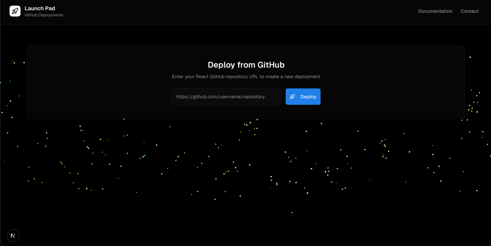

<h1 align="center">Launch Pad</h1>

Launchpad is a streamlined, self-hosted deployment platform tailored for React projects, acting as a lightweight Vercel clone for your static websites.




## Ideal for 

Perfect for your frontend prototyping with v0/Cursor AI tools, you can deploy the static webpage and get a hosted link, no need for ngrok.

## Tech Stack

- Next Js
- AWS EC2
- Redis
- S3
- SQS
- Nginx
- Certbot
- Vercel

## Development 

- Clone the repo 

```bash
git clone https://github.com/RiteshBhoskar/vercel-fe.git
```

- Install dependencies

```bash
npm install
```

- Start the dev server

```bash
npm run dev
```

### Note : This is only the frontend of the whole app.

####  The backned code will be available at [vercel-like](https://github.com/RiteshBhoskar/vercel-like) , [deployment-service](https://github.com/RiteshBhoskar/deployment-service) and [serve-binaries](https://github.com/RiteshBhoskar/serve-binaries-vercel).